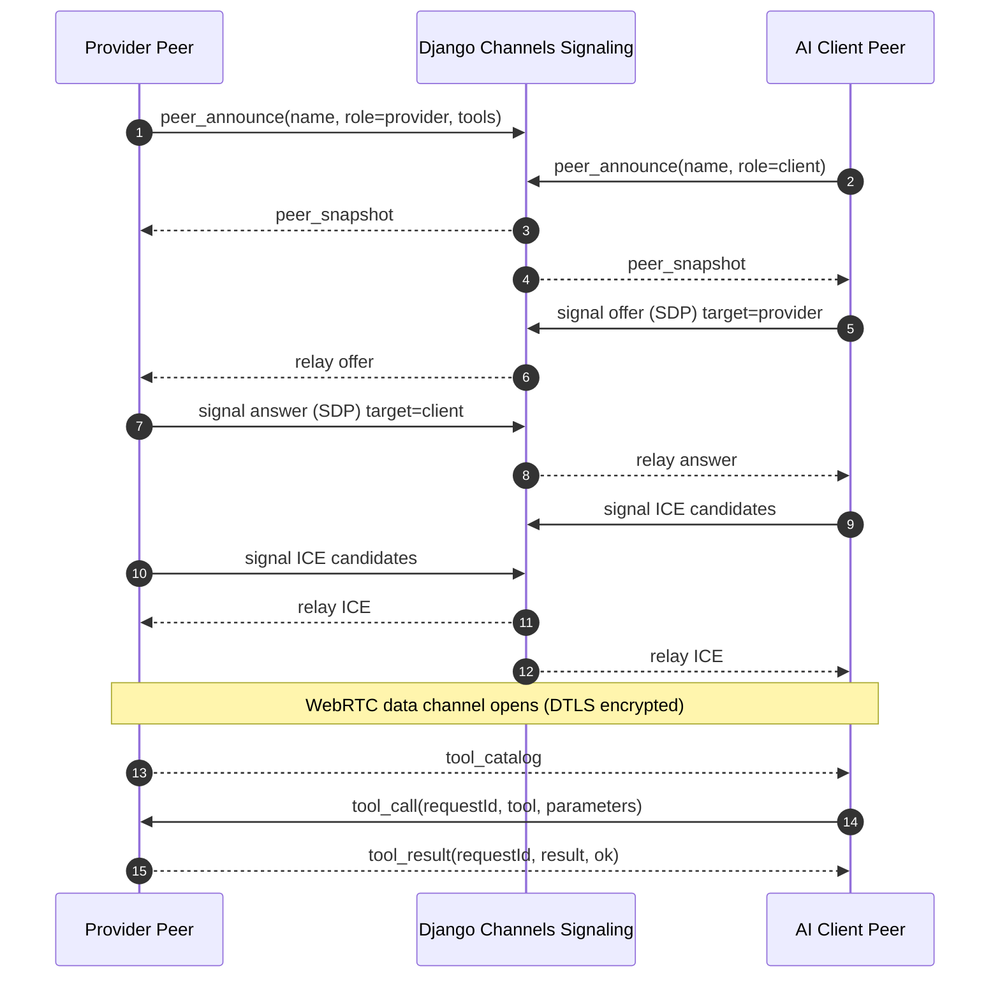
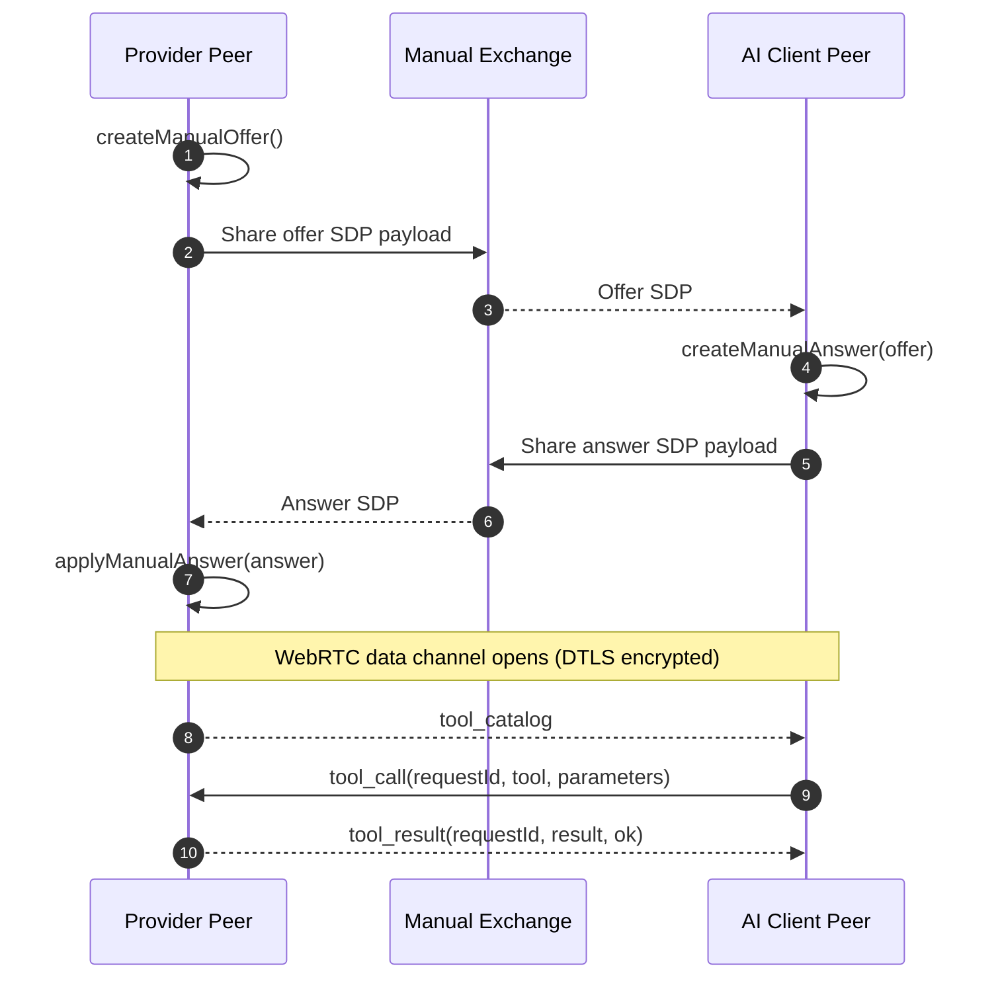
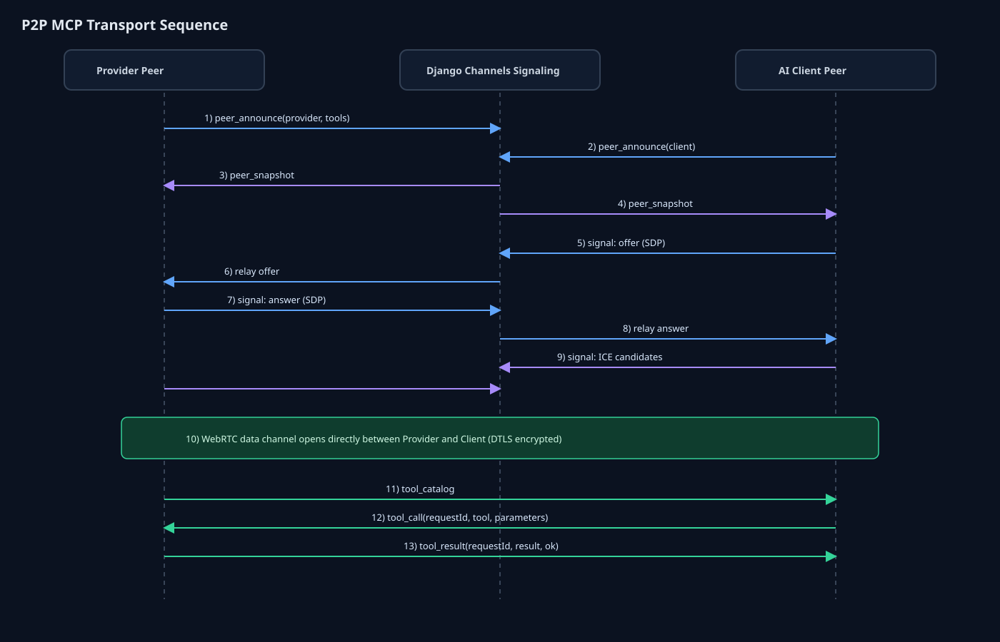

# mcp-webrtc-transport

Monorepo for a WebRTC-based MCP transport demo and the reusable `@fury-r/mcp-webrtc-transport` package.

## Repository layout

- `app/` — React + Vite frontend with the P2P MCP demo UI
- `backend/` — Django + Channels signaling backend
- `modules/mcp-webrtc-transport/` — reusable browser-side TypeScript package

## P2P MCP transport

The reusable MCP transport in `modules/mcp-webrtc-transport` is designed for:

- peer discovery through a signaling websocket
- SDP offer / answer exchange
- ICE candidate relay
- direct MCP tool calls over WebRTC data channels
- privacy-first, low-latency tool execution

This transport supports two signaling approaches:

- backend signaling via Django Channels (`/v1/mcp/session/*` + `/ws/mcp/*`)
- backend-free manual signaling using exchanged SDP payloads (`createManualOffer`, `createManualAnswer`, `applyManualAnswer`)

### Sequence diagrams

#### Backend signaling (Django Channels)



#### Backend-free manual signaling (copy/paste or QR)





### Screenshots


### Quick snippets

#### TypeScript

```ts
import { P2PMcpClient, TMcpTool } from "@fury-r/mcp-webrtc-transport";

const tools: TMcpTool[] = [
  {
    name: "get_device_status",
    description: "Return the current device health summary.",
    parameters: { device_id: "edge-gateway-01" },
  },
];

const client = new P2PMcpClient({
  signalingBaseUrl: "ws://localhost:8001",
  identity: {
    peerName: "Edge Gateway",
    role: "provider",
    tools,
  },
  toolCallHandler: async (message) => {
    if (message.tool === "get_device_status") {
      return {
        device_id: "edge-gateway-01",
        status: "healthy",
        transport: "webrtc-datachannel",
      };
    }

    return { error: `Unknown tool: ${message.tool}` };
  },
});

await client.connect("24f5e189");
```

#### Python interoperability

```py
async def handle_tool_call(message: dict) -> dict:
    if message["tool"] == "get_device_status":
        return {
            "device_id": message["parameters"].get("device_id", "edge-gateway-01"),
            "status": "healthy",
            "transport": "webrtc-datachannel",
        }
    return {"error": f"Unknown tool: {message['tool']}"}

# This transport is a browser-side TypeScript package. Python peers usually
# interoperate by implementing the same signaling contract and exchanging the
# same MCP JSON messages over a WebRTC data channel.
```

For a fuller guide, including reusable screenshot URLs and longer TypeScript/Python examples, see [`docs.md`](./docs.md).

## Local development

### Backend

```bash
cd backend
pip install -r requirements.txt
python manage.py migrate
daphne -p 8001 mysite.asgi:application
```

### Frontend

```bash
cd app
npm install --legacy-peer-deps
npm run dev
```

## Netlify deployment (P2P Share only)

This repository now includes a dedicated GitHub Actions workflow that deploys only the frontend in `P2P Share` mode:

- Workflow: `.github/workflows/netlify-p2p-share.yml`
- Netlify config: `netlify.toml`

In deploy mode, the app sets `VITE_APP_MODE=p2p-share`, which forces the UI to show only the `P2P Share` page (the old `Live Share` page is not exposed in the deployed navigation).

Set these GitHub repository secrets before running the workflow:

- `NETLIFY_AUTH_TOKEN`
- `NETLIFY_SITE_ID`

### Build the reusable package

```bash
# Build from the frontend workspace used by this repository.
cd app
npm run build:mcp-module
```

## Package publishing

The npm-publishable package in this repository is:

- `@fury-r/mcp-webrtc-transport`

It lives in:

```bash
modules/mcp-webrtc-transport
```

The repository includes an automatic release-based publish workflow at:

```bash
.github/workflows/npm-publish.yaml
```

## Additional documentation

- [`docs.md`](./docs.md) — screenshot usage and expanded TS/Python guidance
- [`modules/mcp-webrtc-transport/README.md`](./modules/mcp-webrtc-transport/README.md) — package-focused README

## License

This project is licensed under the Apache 2.0 License. See [`LICENSE`](./LICENSE).
