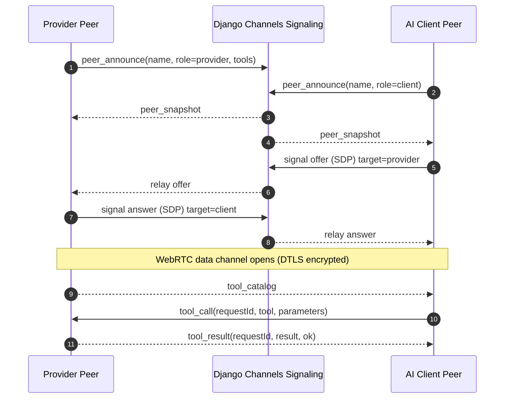
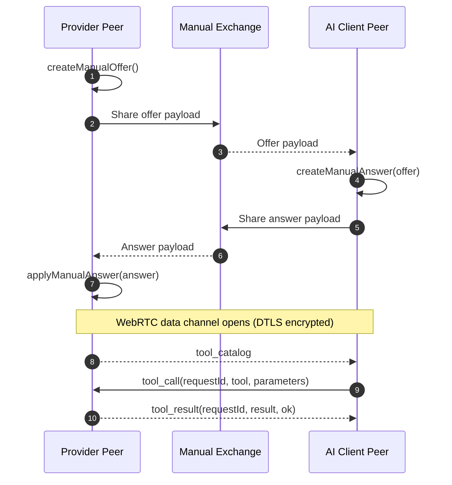

# P2P MCP transport guide

This guide explains how to document and use the peer-to-peer MCP transport that lives in `modules/mcp-webrtc-transport`.

## Screenshot assets

The repository now keeps reusable screenshots in:

- `docs/assets/peer-mcp-overview.png`
- `docs/assets/peer-mcp-session-setup.png`

For GitHub README files, you can embed them with relative paths:

```md


```

For package pages or any README renderer that needs absolute URLs, use the raw GitHub asset URLs:

```md


```

## What the transport does

`@fury-r/mcp-webrtc-transport` is a browser-side TypeScript module for:

- peer discovery over WebSocket signaling
- SDP offer and answer exchange
- ICE candidate relay
- direct MCP tool calls over a WebRTC data channel
- timeline, connection-state, tool-catalog, and tool-result callbacks

## Signaling diagrams

### Backend signaling flow



### Backend-free manual flow



## TypeScript usage

### Provider peer

```ts
import { P2PMcpClient, TMcpTool } from "@fury-r/mcp-webrtc-transport";

const tools: TMcpTool[] = [
  {
    name: "get_device_status",
    description: "Return the current device health summary.",
    parameters: { device_id: "edge-gateway-01" },
  },
  {
    name: "get_recent_logs",
    description: "Read a few recent logs from the edge device.",
    parameters: { device_id: "thermostat_4", limit: 5 },
  },
];

const provider = new P2PMcpClient({
  signalingBaseUrl: "ws://localhost:8001",
  identity: {
    peerName: "Edge Gateway",
    role: "provider",
    tools,
  },
  onConnectionStateChange: (state) => {
    console.log("connection state", state);
  },
  onTimelineEvent: (event) => {
    console.log(`[${event.direction}] ${event.title}`, event.detail);
  },
  toolCallHandler: async (message) => {
    switch (message.tool) {
      case "get_device_status":
        return {
          device_id: message.parameters.device_id,
          status: "healthy",
          transport: "webrtc-datachannel",
        };
      case "get_recent_logs":
        return [
          {
            timestamp: new Date().toISOString(),
            level: "info",
            message: "thermostat_4: telemetry stayed on the peer device",
          },
        ];
      default:
        return { error: `Unknown tool: ${message.tool}` };
    }
  },
});

await provider.connect("24f5e189");
```

### Client peer

```ts
import { P2PMcpClient } from "@fury-r/mcp-webrtc-transport";

const client = new P2PMcpClient({
  signalingBaseUrl: "ws://localhost:8001",
  identity: {
    peerName: "AI Client",
    role: "client",
  },
  onToolCatalog: (message) => {
    console.log("available tools", message.tools);
  },
  onToolResult: (message) => {
    console.log("tool result", message.result);
  },
});

await client.connect("24f5e189");

client.sendToolCall("get_device_status", {
  device_id: "edge-gateway-01",
});
```

## Backend-free MCP signaling (manual)

The transport can run without backend signaling by exchanging SDP payloads manually.

Use this when:

- you want to test quickly without Django Channels
- peers are on the same machine or LAN
- copy/paste or QR exchange is acceptable

### Manual workflow

1. Provider creates a local offer using `createManualOffer()`.
2. Provider shares the offer payload with client (copy/paste, QR, etc.).
3. Client calls `createManualAnswer({ sdp, type: 'offer' })`.
4. Client shares answer payload back to provider.
5. Provider calls `applyManualAnswer({ sdp, type: 'answer' })`.
6. Data channel opens and MCP `tool_catalog` / `tool_call` / `tool_result` flows directly peer-to-peer.

### Minimal manual signaling example

```ts
// provider side
const provider = new P2PMcpClient({
  identity: {
    peerName: "Edge Gateway",
    role: "provider",
    tools,
  },
  toolCallHandler: async (message) => ({ ok: true, tool: message.tool }),
});

const offer = await provider.createManualOffer();
// share offer.sdp with client

// client side
const client = new P2PMcpClient({
  identity: {
    peerName: "AI Client",
    role: "client",
  },
});

const answer = await client.createManualAnswer({ sdp: offerSdp, type: "offer" });
// share answer.sdp back to provider

// provider side
await provider.applyManualAnswer({ sdp: answerSdp, type: "answer" });
```

### Notes and limits

- Manual mode does not use `connect(sessionId)` or backend session endpoints.
- For production-grade connectivity across strict NAT/firewalls, TURN is still commonly required.
- This repository's P2P MCP page can now run in this manual mode without backend signaling.

## Python interoperability usage

This repository does not currently ship a Python package for the transport. Instead, Python usually participates by implementing the same signaling contract and MCP message format on top of a Python WebRTC stack such as `aiortc`.

### Minimal Python tool-call handler

```py
import json

def build_tool_result(message: dict) -> dict:
    if message["tool"] == "get_device_status":
        result = {
            "device_id": message["parameters"].get("device_id", "edge-gateway-01"),
            "status": "healthy",
            "transport": "webrtc-datachannel",
        }
    elif message["tool"] == "get_recent_logs":
        result = [
            {
                "timestamp": "2026-03-10T04:00:00Z",
                "level": "info",
                "message": "thermostat_4: telemetry stayed on the peer device",
            }
        ]
    else:
        result = {"error": f"Unknown tool: {message['tool']}"}

    return {
        "type": "tool_result",
        "requestId": message["requestId"],
        "tool": message["tool"],
        "result": result,
        "ok": "error" not in result,
    }

incoming_message = {
    "type": "tool_call",
    "requestId": "req-123",
    "tool": "get_device_status",
    "parameters": {"device_id": "edge-gateway-01"},
}

print(json.dumps(build_tool_result(incoming_message), indent=2))
```

### Python integration outline

1. Create or fetch a session using the signaling backend.
2. Connect to `ws://<host>/ws/mcp/<session_id>/<peer_id>`.
3. Exchange SDP offers, answers, and ICE candidates.
4. Open a WebRTC data channel.
5. Send and receive MCP JSON payloads:
   - `tool_catalog`
   - `tool_call`
   - `tool_result`

## Signaling contract

The transport expects a signaling backend that exposes:

- `GET /v1/mcp/session/`
- `GET /v1/mcp/session/<session_id>/`
- `ws://<host>/ws/mcp/<session_id>/<peer_id>`

In this repository, Django Channels provides that signaling layer while MCP payloads stay peer-to-peer over WebRTC.

## Backend-free QR file sharing (new)

The frontend now includes a dedicated `P2P Share` page that performs signaling with QR only and transfers files directly over WebRTC.

Flow:

1. Sender selects a file and clicks `Generate Sender QR`.
2. Receiver scans sender QR and automatically generates an `Answer QR`.
3. Sender scans the receiver answer QR.
4. WebRTC data channel opens and the file transfers peer-to-peer.

Notes:

- No app backend API is used in this flow.
- The SDP offer/answer is encoded into QR payloads (`fswebrtc:<base64url>`).
- File chunks are sent as binary `ArrayBuffer` messages over an ordered data channel.
- If camera scanning is unavailable, both peers can copy/paste the same signal payload text.
