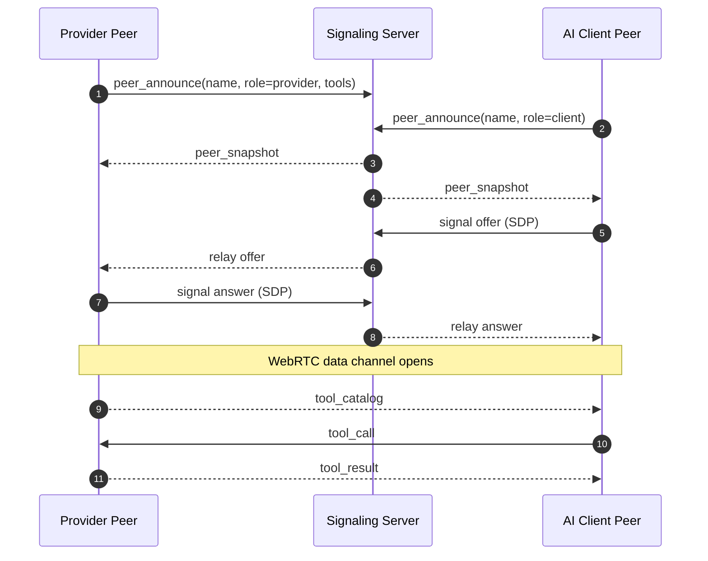
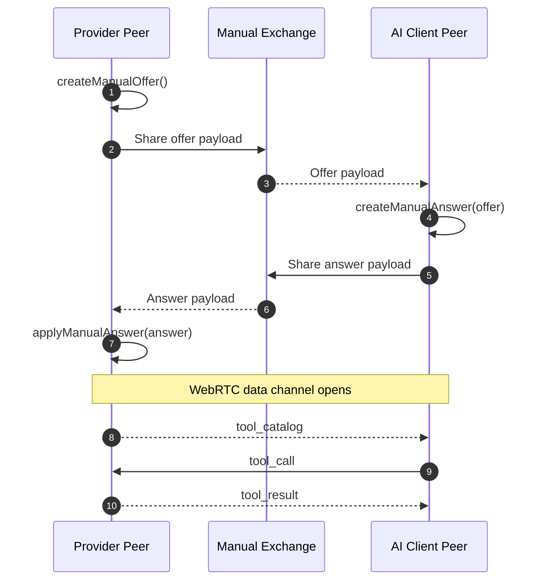

# `@fury-r/mcp-webrtc-transport`

Reusable browser-side TypeScript module for peer-to-peer MCP sessions over WebRTC.

## Screenshots

> These screenshots are stored in the repository so they can also be reused from README files and package pages.


## What it provides

- peer discovery through a signaling websocket
- SDP offer / answer exchange
- ICE candidate relay
- direct MCP tool calls over WebRTC data channels
- event callbacks for peer snapshots, tool catalogs, tool results, and connection state

## Use case

This module is useful when an AI client needs to call tools on a nearby browser or edge device without sending the tool payloads through a central server.

For example, you can use it in a support or operations dashboard where:

- a browser-based AI assistant connects to a field gateway or kiosk
- the server is only used to help the two peers discover each other
- diagnostics, log access, and device actions are exchanged directly over WebRTC

Why use it:

- sensitive tool inputs and results stay on the peer-to-peer channel
- it reduces server bandwidth because MCP traffic does not need to be proxied
- it works well for local-device, edge-device, or privacy-first assistant workflows

## Sequence diagrams

### Backend signaling



### Backend-free manual signaling



## Build

From the repository frontend workspace:

```bash
cd app
npm run build:mcp-module
```

The compiled package is emitted to:

```bash
modules/mcp-webrtc-transport/dist
```

## TypeScript example

```ts
import { P2PMcpClient, TMcpTool } from "@fury-r/mcp-webrtc-transport";

const tools: TMcpTool[] = [
  {
    name: "get_device_status",
    description: "Return the current device health summary.",
    parameters: { device_id: "edge-gateway-01" },
  },
];

const client = new P2PMcpClient({
  signalingBaseUrl: "ws://localhost:8001",
  identity: {
    peerName: "Edge Gateway",
    role: "provider",
    tools,
  },
  toolCallHandler: async (message) => {
    if (message.tool === "get_device_status") {
      return {
        device_id: "edge-gateway-01",
        status: "healthy",
        transport: "webrtc-datachannel",
      };
    }

    return { error: `Unknown tool: ${message.tool}` };
  },
});

await client.connect("24f5e189");
```

## Backend-free manual signaling

You can also run MCP peer connection without a signaling backend by exchanging SDP payloads manually (copy and paste, QR, or any out-of-band channel).

This mode is useful for local demos, LAN tests, and environments where running a signaling server is not desired.

### Provider flow (manual offer)

```ts
import { P2PMcpClient, TMcpTool } from "@fury-r/mcp-webrtc-transport";

const tools: TMcpTool[] = [
  {
    name: "get_device_status",
    description: "Return current status",
    parameters: { device_id: "edge-gateway-01" },
  },
];

const provider = new P2PMcpClient({
  identity: {
    peerName: "Edge Gateway",
    role: "provider",
    tools,
  },
  toolCallHandler: async (message) => {
    if (message.tool === "get_device_status") {
      return {
        device_id: message.parameters.device_id,
        status: "healthy",
        transport: "webrtc-datachannel",
      };
    }
    return { error: `Unknown tool: ${message.tool}` };
  },
});

const offer = await provider.createManualOffer();
// Send `offer.sdp` to the client peer by copy/paste or QR.
```

### Client flow (apply offer, return answer)

```ts
import { P2PMcpClient } from "@fury-r/mcp-webrtc-transport";

const client = new P2PMcpClient({
  identity: {
    peerName: "AI Client",
    role: "client",
  },
  onToolCatalog: (message) => {
    console.log("catalog", message.tools);
  },
  onToolResult: (message) => {
    console.log("result", message.result);
  },
});

const answer = await client.createManualAnswer({
  sdp: offerSdpFromProvider,
  type: "offer",
});
// Send `answer.sdp` back to provider.
```

### Provider final step

```ts
await provider.applyManualAnswer({
  sdp: answerSdpFromClient,
  type: "answer",
});

// After data channel opens, the client can call tools directly.
client.sendToolCall("get_device_status", { device_id: "edge-gateway-01" });
```

Notes:

- In manual mode, do not call `connect(sessionId)`.
- In websocket mode, keep using `signalingBaseUrl` + `connect(sessionId)`.
- A direct connection can still fail on restrictive networks; use TURN infrastructure for high-connectivity production environments.

## Python interoperability example

This package is browser-side TypeScript, so Python usage is typically an interoperability story rather than a direct package import. A Python peer can implement the same signaling contract and exchange the same MCP messages over a WebRTC data channel.

```py
import json

SIGNALING_HTTP_BASE = "http://localhost:8001"
SIGNALING_WS_BASE = "ws://localhost:8001"

async def get_device_status(parameters: dict) -> dict:
    return {
        "device_id": parameters.get("device_id", "edge-gateway-01"),
        "status": "healthy",
        "transport": "webrtc-datachannel",
    }

async def handle_tool_call(raw_message: str) -> str:
    message = json.loads(raw_message)
    if message["type"] != "tool_call":
        return json.dumps({"ok": False, "error": "unsupported_message"})

    if message["tool"] == "get_device_status":
        result = await get_device_status(message.get("parameters", {}))
    else:
        result = {"error": f"Unknown tool: {message['tool']}"}

    return json.dumps(
        {
            "type": "tool_result",
            "requestId": message["requestId"],
            "tool": message["tool"],
            "result": result,
            "ok": "error" not in result,
        }
    )
```

See the repository guide for a longer walkthrough:

- [`docs.md`](https://github.com/fury-r/mcp-webrtc-transport/blob/master/docs.md)

## Signaling contract

This package expects a signaling backend that exposes:

- `GET /v1/mcp/session/`
- `GET /v1/mcp/session/<session_id>/`
- `ws://<host>/ws/mcp/<session_id>/<peer_id>`

In this repository, Django Channels provides that signaling layer while MCP payloads remain peer-to-peer over WebRTC.
